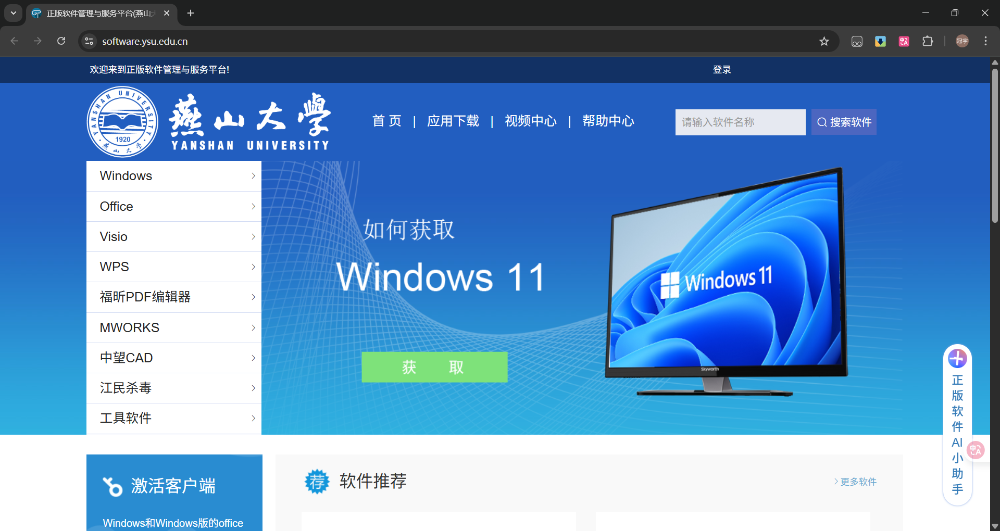
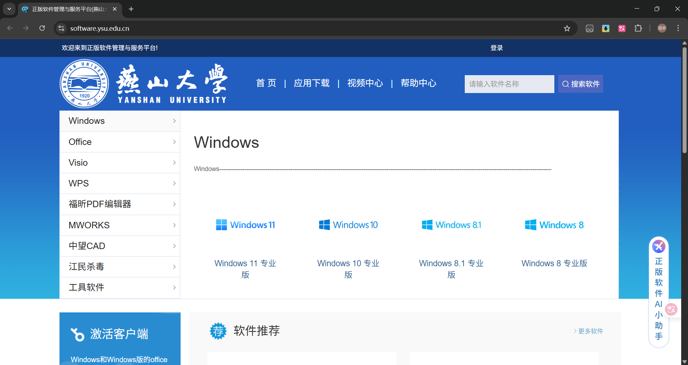
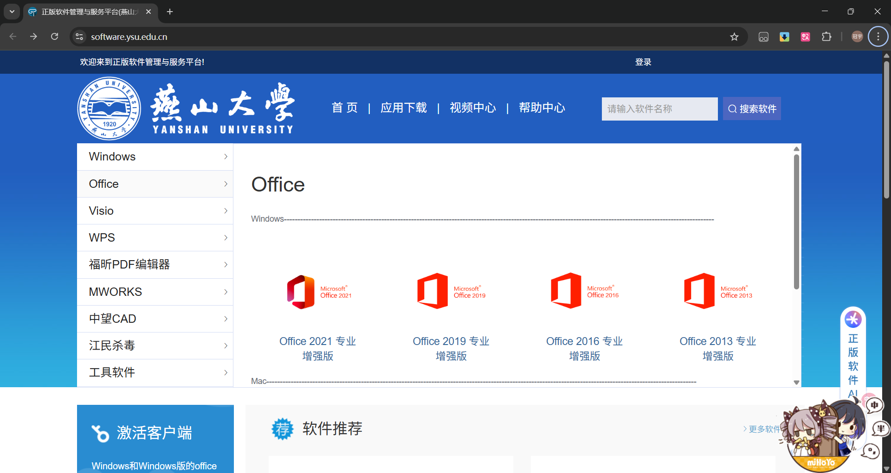
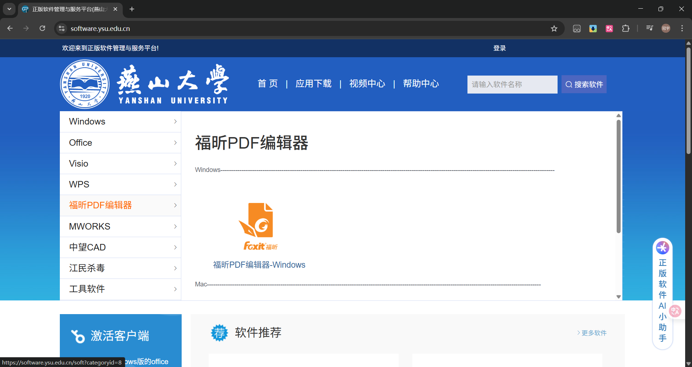

---
tags:
  - 正版软件
  - 校园服务
authors:
  - liugu2023
---
# 校园正版化

燕山大学正版软件管理与服务平台提供 Windows、Office、Visio、WPS、福昕 PDF 编辑器、中望 CAD、MWORKS 等软件。实际可下载的软件和版本以平台当前页面为准。

> **安全提醒**
>
> 平台仍可下载某个旧版本，不代表该版本仍能获得厂商安全更新。新装软件时应优先选择仍在支持期内的版本，并及时安装系统和安全更新。本页生命周期信息核验于 2026 年 7 月 10 日。

## 访问方式

可通过一网通办搜索`校园正版化`并点击进入，或访问[燕山大学正版软件管理与服务平台](https://software.ysu.edu.cn/)。

## 常用软件

下面介绍几个常用软件的下载入口。截图中的版本和按钮可能随平台更新。

### Windows

新装电脑应优先选择满足硬件要求、仍在 Microsoft 支持期内的 Windows 11 版本。在主页点击`Windows`板块，再选择平台当前提供的受支持版本。

进入详情页后，可下载 ISO 镜像并查看安装指引。

Windows 8、Windows 8.1 已结束支持；Windows 10 Home 和 Pro 的常规支持已于 2025 年 10 月 14 日结束。除非确有旧软件兼容需求并了解安全风险，否则不要把这些版本作为日常联网电脑的新装选择。可在 [Microsoft 产品生命周期页面](https://learn.microsoft.com/zh-cn/lifecycle/products/windows-10-home-and-pro)核对最新状态。

> **提示**
>
> 平台当前的激活帮助入口为[帮助页面](https://software.ysu.edu.cn/help/detail/2)。请登录后确认说明适用于自己安装的系统版本。

### Office

在主页点击`Office`板块，优先选择平台当前提供且仍在支持期内的版本。下面的截图以 Office 2021 为例。

进入详情页后，可下载安装文件并查看安装指引。

Office 2013、2016 和 2019 已结束支持，不建议用于日常处理联网文档。Office 2021 将于 2026 年 10 月 13 日结束支持；如果现在安装，应提前准备后续升级方案。Mac 版旧版本同样需要核对生命周期，不要只根据平台是否保留下载入口来判断。可查看 Microsoft 的 [Office 2016](https://learn.microsoft.com/zh-cn/lifecycle/products/microsoft-office-2016)、[Office 2019](https://learn.microsoft.com/zh-cn/lifecycle/products/microsoft-office-2019)和 [Office 2021](https://learn.microsoft.com/zh-cn/lifecycle/products/office-2021)生命周期页面。

> **提示**
>
> 平台当前的激活帮助入口同样指向[帮助页面](https://software.ysu.edu.cn/help/detail/2)。请登录后按所装产品的实际说明操作。

### Visio

在主页点击`Visio`板块，选择平台当前提供且仍在厂商支持期内的版本。下面的截图以 Visio 2021 为例。

进入详情页后，可下载安装文件并查看安装指引。旧版本仅在确有兼容需求时使用，并应核对其生命周期。

### 福昕PDF编辑器

在主页点击`福昕PDF编辑器`板块，再选择与自己操作系统匹配的版本。

进入详情页后，可下载安装文件并查看安装指引。

### 更多软件

更多软件请访问平台首页查看。
